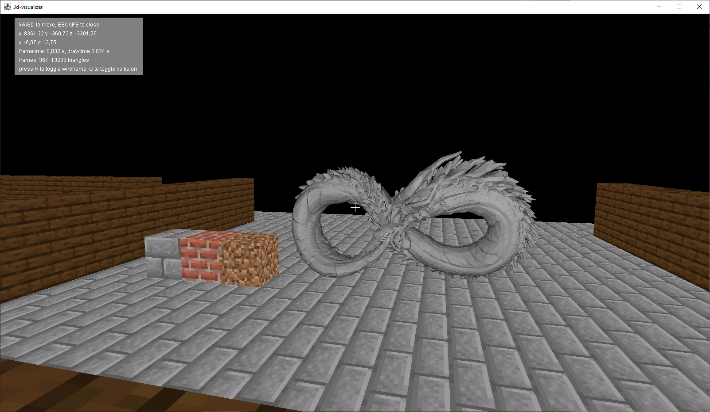
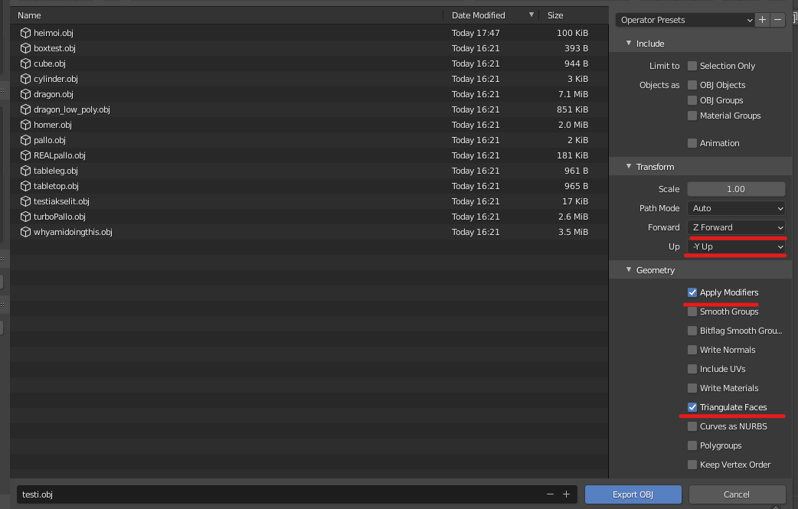
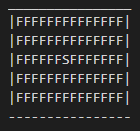

# 3D-visualizer

A 3D-renderer using Swing and basic Graphics. Supports .obj-file loading (no texturing support yet), texture loading for simple objects and map loading from a text-based format.

## Prerequisites

To run the project you will need <strong>Java (JDK 21)</strong> and <strong>sbt</strong>

## Installation

1. Clone the repo

   git clone git@github.com:kqlski/3D-Visualizer.git

2. Inside the repository root, do `sbt run`

## Other Instructions

### Loading .obj-files

1. Open the file you want to load in Blender
2. when Exporting to .obj, choose these settings:
   
3. export the file directly or move it to the objects-folder, this is where the program loads the files.
4. In VisualizerApp, add a new object to the World by adding an Object to worldObjects (line 25). There are example imports. Setting a starting scale of 100 is recommended due to scaling differences.

### Loading textures (for walls, floors and cubes)

1. Move a (continuous) texture image (.png/.jpg confirmed to be working) to textures-folder.
2. Load the texture by adding it to the Map
   'textures' in VisualizerApp (line 16). There are example textures in the file.
3. Apply the new texture by giving the key you gave your texture in step 2 to either 'wallTexture' or 'floorTexture' (lines 22 & 23 in VisualizerApp) OR create a new Cube inside worldObjects and give the texture-key to that.

### Creating a custom map file

The file-format understands certain characters that each represent different things. Each character represents a 600-by-600 tile in the coordinate system:

- F : Floor
- \_ : Wall that is in the bottom-half of the tile
- \- : Wall that is in the top-half of the tile
- | : Wall that is in the center of the tile but has been rotated 90 degrees
- \* : an empty tile
- S : the tile where the "Player" starts. If a floorTexture has been set, creates a floor under the player.
